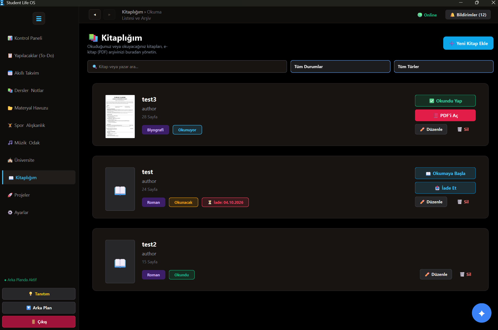

# Student Life OS

> Öğrenci hayatının ders, görev, proje, materyal, kütüphane, spor ve odak çalışmalarını tek bir Windows masaüstü uygulamasında birleştiren productivity platformu.

[](https://www.microsoft.com/windows)
[](https://www.python.org/)
[](https://doc.qt.io/qtforpython/)
[](LICENSE)

**Student Life OS**, üniversite öğrencilerinin akademik ve günlük planlarını yerel veritabanıyla yönetmesini sağlayan Python ve PySide6 tabanlı bir Windows masaüstü uygulamasıdır.

Veriler varsayılan olarak bilgisayarda tutulur ve bulut hesabına bağımlı bir kullanım gerektirmez.

---

## 📋 İçindekiler

- [Neler Sunar?](#-neler-sunar)
  - [Akademik Planlama](#akademik-planlama)
  - [Kişisel Takip](#kişisel-takip)
  - [Materyal ve AI](#materyal-ve-ai)
- [Uygulama Görüntüleri](#-uygulama-görüntüleri)
- [Gereksinimler](#-gereksinimler)
- [Kurulum](#-kurulum)
- [Yapılandırma](#-yapılandırma)
- [Yerel AI Modeli](#-yerel-ai-modeli)
- [Windows EXE Oluşturma](#-windows-exe-oluşturma)
- [Gelişmiş Kullanım](#-gelişmiş-kullanım)
- [Veri ve Gizlilik](#-veri-ve-gizlilik)
- [Sorun Giderme](#-sorun-giderme)
- [Lisans](#-lisans)

---

# 🚀 Neler Sunar?

## 📚 Akademik Planlama

Student Life OS, üniversite hayatının akademik tarafını tek bir merkezden yönetmenizi sağlar.

- Ders yönetimi
- Haftalık ders programı
- Sınav takibi
- Akademik takvim
- **Görüntü İşleme (OCR)** ile ders programı fotoğraflarını otomatik olarak tarama
- OCR ile elde edilen bilgileri sisteme otomatik aktarma
- Kredi bazlı **Dönem Ortalaması (SPA)** hesaplama
- **Genel Not Ortalaması (CGPA)** hesaplama
- To-do listesi
- Proje yönetimi
- Günlük planlama
- Sistem tepsisi bildirimleri
- Yaklaşan dönem sayaçları
- Zamanlanmış hatırlatıcılar

---

## 🧑‍💻 Kişisel Takip

Akademik hayatın yanında günlük yaşamınızı da takip edebilirsiniz.

### 📖 Kitaplığım

- E-kitap (PDF) arşivi
- Fiziksel kitap arşivi
- Otomatik kitap kapak görseli çıkarma
- Ödünç alınan kitapların takibi
- İade tarihi takibi
- Kitabın bulunduğu kişi/konum bilgisi
- İade tarihi yaklaşınca bildirim

### 🏋️ Spor ve Alışkanlıklar

- Antrenman takibi
- Spor geçmişi
- Alışkanlık takibi
- Alışkanlık zinciri (streak) sistemi
- Günlük ilerleme takibi

### 🎵 Müzik ve Odak

- YouTube Music entegrasyonu
- Yerel müzik oynatıcı
- Pomodoro odak sayacı
- Odak çalışma takibi

### 🌦️ Kontrol Paneli

Dashboard üzerinde:

- Hava durumu
- Günün sözü
- Online / Offline durum göstergesi
- Günlük görevler
- Yaklaşan etkinlikler
- Ders bilgileri
- Dönem sayaçları

gibi bilgiler tek bir ekranda görüntülenebilir.

---

# 🤖 Materyal ve AI

## 📁 Materyal Kasası

Farklı dosya formatlarını uygulama içerisinden yönetebilirsiniz.

Desteklenen formatlar:

- HTML
- PDF
- DOCX
- PPTX
- XLSX
- CSV

Belgeler için:

- Ön izleme
- İçerik görüntüleme
- Kelime işlemci benzeri düzenleme
- Dosya yönetimi
- Kelime sayısı ve dosya bilgileri

gibi özellikler sunulur.

---

## 🧠 AI Asistanı

Student Life OS içerisinde farklı AI sağlayıcıları kullanılabilir.

Desteklenen seçenekler:

- Google Gemini
- OpenAI
- Anthropic Claude
- Yerel GGUF modelleri

AI asistanı uygulamanın yerel veritabanındaki bilgilerle çalışabilecek şekilde tasarlanmıştır.

Örneğin:

- Dersleri görüntüleme
- Görevleri yönetme
- Akademik programı analiz etme
- Projeler hakkında bilgi verme
- Çalışma planı oluşturmaya yardımcı olma

gibi işlemler gerçekleştirilebilir.

> AI sağlayıcılarının kullanılabilmesi için ilgili API anahtarlarının uygulama içerisindeki ayarlardan yapılandırılması gerekir.

---

## 🔌 Offline Çalışma

Student Life OS, internet bağlantısının olmadığı durumları da dikkate alacak şekilde tasarlanmıştır.

İnternet gerektirmeyen temel özellikler yerel olarak çalışabilir.

Örneğin:

- Dersler
- Görevler
- Projeler
- Kitaplık
- Yerel müzik
- Yerel veritabanı
- Bazı materyal işlemleri

internet bağlantısı olmadan kullanılabilir.

---

# 🖼️ Uygulama Görüntüleri

Uygulamaya ait ekran görüntüleri `images/` klasöründe bulunmaktadır.

### 📊 Kontrol Paneli


### ✅ Yapılacaklar


### 📅 Akıllı Takvim


### 🎓 Dersler ve Notlar


### 📁 Materyal Kasası


### 🏋️ Spor ve Alışkanlık


### 🎵 Müzik ve Odak


### 🎓 Üniversite


### 📚 Kitaplık



### 🤖 AI Asistanı


---

# 💻 Gereksinimler

## İşletim Sistemi

- Windows 10 veya daha yeni bir Windows sürümü

## Python

- Python 3.11+
- Python 3.11 veya 3.12 önerilir

## İnternet Bağlantısı

İnternet bağlantısı aşağıdaki özellikler için gereklidir:

- AI API'leri
- YouTube Music
- Güncel hava durumu
- İnternet üzerinden gerçekleştirilen diğer servisler

Temel uygulama özelliklerinin önemli bir bölümü Offline olarak çalışabilir.

## Python Kütüphaneleri

Uygulamanın kullandığı temel kütüphaneler:

- `PySide6`
- `PyMuPDF`
- `python-docx`
- `python-pptx`
- `pandas`
- `openpyxl`
- `xlrd`
- `easyocr`

Tüm bağımlılıklar `requirements.txt` içerisinde bulunmaktadır.

## Yerel AI Modeli

Yerel AI kullanılacaksa aşağıdaki model dosyasının bulunması gerekir:

```text
resources/models/local_model.gguf
# ⚙️ Kurulum

## 1. Depoyu Klonlayın

PowerShell açarak:

```powershell
git clone https://github.com/furkiyildirim/StudentLifeOS.git
Set-Location StudentLifeOS
```

---

## 2. Sanal Ortam Oluşturun

```powershell
python -m venv .venv
```

Sanal ortamı aktif edin:

```powershell
.\.venv\Scripts\Activate.ps1
```

---

## 3. Pip'i Güncelleyin

```powershell
python -m pip install --upgrade pip
```

---

## 4. Bağımlılıkları Yükleyin

```powershell
python -m pip install -r requirements.txt
```

---

## 5. Uygulamayı Başlatın

```powershell
python app.py
```

İlk çalıştırmada uygulama proje klasörü içerisinde:

```text
student_life.db
```

dosyasını oluşturur.

Kullanıcı dosyaları:

```text
vault_storage/
```

klasöründe, kitap kapakları ise:

```text
resources/covers/
```

klasöründe tutulur.

---

## ⚠️ PowerShell Aktivasyon Hatası

PowerShell script çalıştırma politikası sanal ortamın aktive edilmesini engelliyorsa, mevcut PowerShell oturumu için:

```powershell
Set-ExecutionPolicy -Scope Process -ExecutionPolicy Bypass
```

komutunu çalıştırın.

Daha sonra:

```powershell
.\.venv\Scripts\Activate.ps1
```

komutuyla sanal ortamı tekrar aktive edin.

---

# ⚙️ Yapılandırma

Uygulama içerisindeki **Ayarlar** ekranından çeşitli seçenekler yönetilebilir.

### 🤖 AI Ayarları

* AI sağlayıcısı seçimi
* Gemini API anahtarı
* OpenAI API anahtarı
* Anthropic API anahtarı
* Yerel AI modeli

### 🔔 Bildirimler

* Bildirimleri açma/kapatma
* Ders hatırlatıcıları
* Görev bildirimleri
* Hatırlatıcı zamanları
* Bildirim sesleri

### 🌦️ Hava Durumu

* Konum ayarları
* Hava durumu görünümü
* Güncel hava durumu bilgileri

### 🎓 Akademik Dönem

* Dönem başlangıç tarihi
* Dönem bitiş tarihi
* Akademik dönem ayarları

---

# 🔐 API Anahtarları

API anahtarları uygulamanın yerel SQLite ayarlar tablosunda tutulur.

API anahtarları:

* Kaynak koduna eklenmemelidir.
* GitHub'a gönderilmemelidir.
* `README.md` içerisinde paylaşılmamalıdır.
* `.env` veya güvenli yerel yapılandırma yöntemleri tercih edilmelidir.

> Gerçek API anahtarlarınızı GitHub repository'sine kesinlikle yüklemeyin.

---

# 🧠 Yerel AI Modeli

Student Life OS, internet bağlantısına ihtiyaç duymadan AI asistanı çalıştırabilmek için yerel GGUF modellerini destekler.

Varsayılan olarak:

**Qwen2.5 Coder 3B Instruct**

modelinin GGUF formatındaki `Q4_K_M` sürümü kullanılabilir.

Model dosyası yaklaşık **1.8 GB** olduğu için GitHub repository'sine dahil edilmez.

Model aşağıdaki konumda bulunmalıdır:

```text
resources/
└── models/
    └── local_model.gguf
```

---

## 📥 Modeli PowerShell ile İndirme

Proje klasöründe PowerShell açın ve:

```powershell
New-Item -ItemType Directory -Force resources\models | Out-Null
```

Ardından:

```powershell
Invoke-WebRequest `
    -Uri "https://huggingface.co/Qwen/Qwen2.5-Coder-3B-Instruct-GGUF/resolve/main/qwen2.5-coder-3b-instruct-q4_k_m.gguf?download=true" `
    -OutFile "resources\models\local_model.gguf"
```

İndirme tamamlandıktan sonra model otomatik olarak uygulama tarafından kullanılabilir.

---

# 📦 Windows EXE Oluşturma

Student Life OS, PyInstaller kullanılarak Windows için paketlenebilir.

Sanal ortam aktifken proje klasöründe:

```powershell
.\build_exe.ps1
```

komutunu çalıştırın.

Build script'i:

```text
StudentLifeOS.spec
```

dosyasını kullanarak uygulamayı Windows için paketler.

---

## 📁 Dağıtım Yapısı

PyInstaller ile oluşturulan uygulama klasör halinde dağıtılır.

Örnek yapı:

```text
StudentLifeOS.exe
StudentLifeOS/
│
├── StudentLifeOS.exe  <-- Bunu kullan
│
├── _internal/
│
├── resources/
│
├── vault_storage/
│
└── student_life.db
```

> `resources/` klasörü EXE ile aynı seviyede tutulmalıdır.

> `_internal/` klasöründeki DLL ve diğer dosyalar uygulamanın çalışması için gereklidir.

EXE dosyasını tek başına farklı bir klasöre taşımayın.

---

# 💾 Kullanıcı Verilerinin Yedeklenmesi

Uygulama tarafından oluşturulan önemli kullanıcı verileri:

```text
student_life.db
vault_storage/
resources/covers/
```

Bu dosya ve klasörleri yedekleyerek uygulamadaki verilerinizi başka bir bilgisayara taşıyabilirsiniz.

---

# 🏗️ Gelişmiş Kullanım

## 📂 Proje Yapısı

```text
StudentLifeOS/
│
├── app.py
│
├── core/
│   ├── database/
│   ├── ai_agent/
│   ├── network/
│   ├── ocr/
│   ├── audio/
│   └── events/
│
├── views/
│   ├── dashboard_view.py
│   ├── library_view.py
│   ├── vault_view.py
│   ├── timetable_view.py
│   └── ...
│
├── widgets/
│
├── resources/
│   ├── themes/
│   ├── icons/
│   ├── covers/
│   ├── sounds/
│   └── models/
│
├── vault_storage/
│
├── images/
│
├── schema.sql
├── requirements.txt
├── StudentLifeOS.spec
├── build_exe.ps1
└── README.md
```

---

# 🗄️ Veri ve Gizlilik

Student Life OS temel olarak **yerel veri saklama** yaklaşımını kullanır.

Ana veriler:

```text
student_life.db
```

SQLite veritabanında tutulur.

Dosya tabanlı materyaller:

```text
vault_storage/
```

klasöründe saklanır.

Kitap kapakları:

```text
resources/covers/
```

altında tutulur.

Uygulamanın temel kullanımında zorunlu bir bulut hesabı bulunmaz.

Ancak aşağıdaki özellikler harici servislerin kullanılmasını gerektirebilir:

* Gemini
* OpenAI
* Anthropic
* YouTube Music
* Hava durumu servisleri

Bu servisler kullanıldığında ilgili veriler, kullanılan servislerin API'leri üzerinden işlenebilir.

---

# 🛠️ Sorun Giderme

## Python bulunamıyor

Python'ın kurulu olduğunu kontrol edin:

```powershell
python --version
```

Örneğin:

```text
Python 3.11.x
```

veya:

```text
Python 3.12.x
```

gibi bir çıktı almalısınız.

---

## Sanal ortam aktive olmuyor

PowerShell'de:

```powershell
Set-ExecutionPolicy -Scope Process -ExecutionPolicy Bypass
```

komutunu çalıştırıp tekrar deneyin:

```powershell
.\.venv\Scripts\Activate.ps1
```

---

## Bağımlılık hatası

Sanal ortamın aktif olduğundan emin olun:

```powershell
.\.venv\Scripts\Activate.ps1
```

Ardından:

```powershell
python -m pip install --upgrade pip
python -m pip install -r requirements.txt
```

---

## Uygulama başlamıyor

Öncelikle:

```powershell
python app.py
```

komutuyla çalıştırarak terminaldeki hata mesajını kontrol edin.

Eksik bir Python paketi varsa:

```powershell
python -m pip install -r requirements.txt
```

komutunu tekrar çalıştırın.

---

# 🔒 Güvenlik

Bu repository'ye aşağıdaki bilgileri kesinlikle eklemeyin:

```text
API Keys
Passwords
Access Tokens
Private Keys
.env
Personal Database
Personal Documents
```

Özellikle:

```text
student_life.db
```

kişisel bilgiler içerebileceğinden public repository'ye gönderilmeden önce kontrol edilmelidir.

---

# 📄 Lisans

Bu proje **MIT License** altında geliştirilmektedir.

Detaylar için [`LICENSE`](LICENSE) dosyasına bakabilirsiniz.

---

# ⭐ Student Life OS

Student Life OS, üniversite hayatındaki farklı araçları tek bir masaüstü uygulamasında birleştirmeyi amaçlayan bir projedir.

**Planla. Çalış. Öğren. Takip Et. Geliş.**

