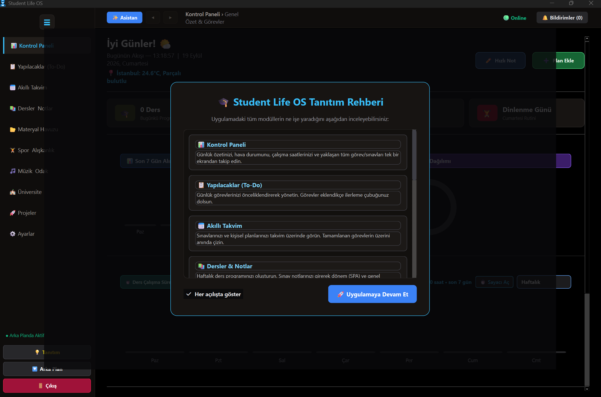
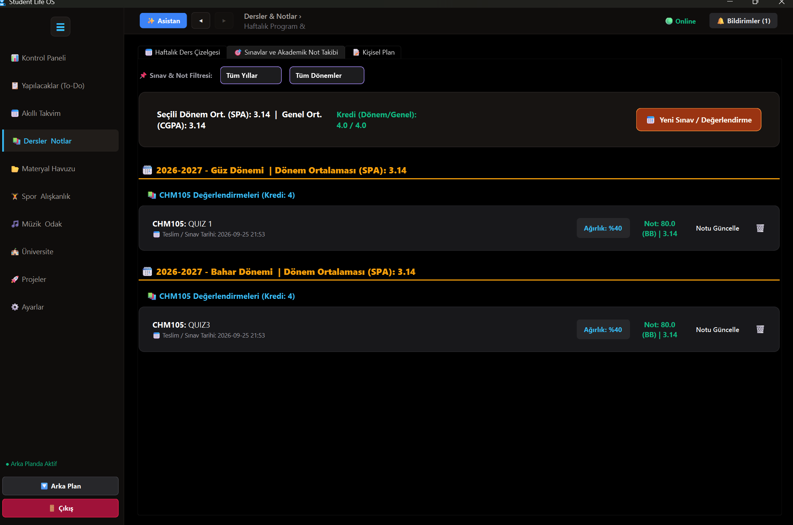

# Student Life OS

> Öğrenci hayatının ders, görev, proje, materyal, kütüphane, spor ve odak çalışmalarını tek bir Windows masaüstü uygulamasında birleştiren productivity platformu.

[](https://www.microsoft.com/windows)
[](https://www.python.org/)
[](https://doc.qt.io/qtforpython/)
[](LICENSE)

Student Life OS, üniversite öğrencilerinin akademik ve günlük planlarını yerel veritabanıyla yönetmesini sağlayan Python ve PySide6 tabanlı bir masaüstü uygulamasıdır. Veriler varsayılan olarak bilgisayarda tutulur; bulut hesabına bağımlı bir kullanım gerektirmez.

## İçerik

- [Neler Sunar?](#neler-sunar)
- [Gereksinimler](#gereksinimler)
- [Kurulum](#kurulum)
- [Yapılandırma](#yapilandirma)
- [Yerel AI Modeli](#yerel-ai-modeli)
- [Gelişmiş Kullanım](#gelismis-kullanim)
- [Veri ve Gizlilik](#veri-ve-gizlilik)
- [Sorun Giderme](#sorun-giderme)
- [Lisans](#lisans)

## Neler Sunar?

### Akademik Planlama

- Dersler, haftalık ders programı, sınavlar ve akademik takvim.
- **Görüntü İşleme (OCR):** Ders programı fotoğraflarını yerel olarak tarayıp sisteme otomatik aktarma.
- Kredi bazlı Dönem Ortalaması (SPA) ve Genel Not Ortalaması (CGPA) hesaplamaları.
- To-do listesi, projeler ve günlük planlama.
- Sistem tepsisi bildirimleri, yaklaşan dönem sayaçları ve zamanlanmış hatırlatıcılar.

### Kişisel Takip

- **Kitaplığım:** E-kitap (PDF) ve fiziksel kitap arşivi, otomatik kapak çıkarma ve "Ödünç Alınan" kitapların (iade tarihi/konumu) bildirimli takibi.
- Spor, antrenman ve alışkanlık zinciri takibi.
- YouTube Music, yerel müzik çalar ve Pomodoro odak sayacı.
- Hava durumu, "Günün Sözü" motivasyonu ve dinamik ağ (Online/Offline) göstergesi içeren Kontrol Paneli.

### Materyal ve AI

- HTML destekli notlar, DOCX, PPTX, XLSX ve CSV dosyaları için entegre ön izleme ve kelime işlemci (Word) tarzı düzenleme.
- Gemini, OpenAI, Anthropic veya yerel GGUF model kullanan, veritabanını okuyup yönetebilen AI asistanı.
- İnternet kesintilerine karşı dinamik "Offline" koruma modülleri.
- SQLite tabanlı yerel veri saklama.

## Uygulama Görüntüleri

Uygulamanın ekran görüntüleri `images/` klasöründen:







## Gereksinimler

- Windows 10 veya daha yeni bir Windows sürümü
- Python 3.11 veya 3.12 önerilir
- İnternet bağlantısı: AI API'leri, YouTube Music ve güncel hava durumu için gereklidir (Temel özellikler, Kitaplık ve Yerel Müzik Offline çalışır).
- **Sistem Kütüphaneleri:** Arayüz için `PySide6`, Döküman/PDF işlemleri için `PyMuPDF`, `python-docx`, `python-pptx`, `pandas`, `openpyxl`, `xlrd`, Görüntü işleme (OCR) için `easyocr`.
- Yerel model kullanılacaksa `resources/models/local_model.gguf` dosyası

## Kurulum

### 1. Depoyu klonlayın

```powershell
git clone [https://github.com/furkiyildirim/StudentLifeOS.git](https://github.com/furkiyildirim/StudentLifeOS.git)
Set-Location StudentLifeOS